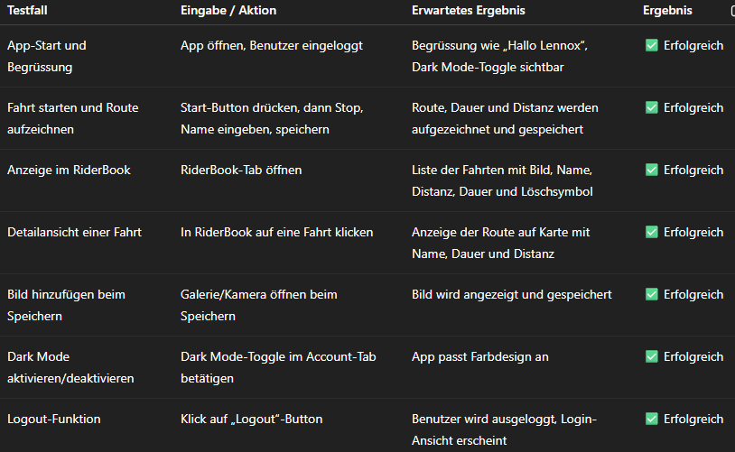
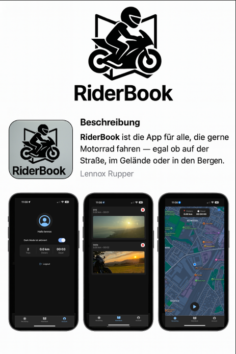

Systemdokumentation – RiderBook App

1. Grundkonzept
Die RiderBook App ist eine mobile Anwendung für Motorradfahrer, mit der Fahrten aufgezeichnet, visualisiert und statistisch ausgewertet werden können. Sie dient als digitales Fahrtenbuch und richtet sich an technisch interessierte Nutzerinnen und Nutzer, die ihre Touren intuitiv und modern dokumentieren möchten. Besonderheiten der App sind der Dark Mode, eine moderne Benutzeroberfläche im Apple-Design, sowie die Möglichkeit, pro Fahrt ein Bild und eine Route zu speichern.

2. Architektur
  Die App ist mit React Native auf Basis von Expo und TypeScript entwickelt. Die Navigation erfolgt über expo-router im Tab-Layout. Der zentrale Zustand wird mit Hilfe eines AppContext verwaltet, in dem z. B. Theme-Farben, Routen, Statistiken und Userdaten gespeichert sind.
  Hauptkomponenten:
- AppContext.tsx: globale Zustände, Theme, Fahrten-Management
- RecordingPage: GPS-Tracking, Zeit- und Distanzmessung, Routenaufzeichnung
- RideSaveModal: Fahrt speichern, Bild hinzufügen
- RiderBook: Übersicht aller gespeicherten Fahrten
- DetailRide: Kartenansicht der Route mit Zusatzinfos
- AccountPage: Statistik, Darkmode-Toggle, Logout

  
3. Umsetzungspunkte
- Dark Mode: über Switch umschaltbar, Themefarben werden dynamisch gesetzt
- Datenhaltung: Fahrten werden lokal und online gespeichert, inkl. Bild und GPS-Route
- Statistik: Fahrtenanzahl, Gesamtdistanz und Dauer werden automatisch berechnet
- Bildfunktion: Bilder können direkt aufgenommen oder aus der Galerie hinzugefügt werden
- Navigation: Tabs für "Aufzeichnen", "RiderBook", "Account"

4. Benutzeranleitung (Kurzform)
   Login/Registrierung: Neues Konto erstellen oder einloggen
   Aufzeichnen starten: "Play" drücken auf der Startseite
   Pause / Stop: Fahrt anhalten oder beenden
   Fahrt speichern: Name und Bild auswählen, speichern
   RiderBook: Alle Fahrten ansehen, bearbeiten oder löschen
   Account: Statistik einsehen, Darkmode aktivieren, Logout

 
5. Persistenzlösung
- Online-Speicherung über Supabase:
  - Fahrten: Tabelle rides
  - Routenpunkte: Tabelle route_points
- Lokal: Darkmode-Einstellung mit AsyncStorage gespeichert
Diese Kombination gewährleistet sowohl Benutzerbindung als auch Wiederverwendbarkeit und Synchronisierung auf mehreren Geräten.

6. Sensor-Nutzung
- GPS: Standort wird via expo-location erfasst und in regelmäßigen Intervallen gespeichert. Die Route wird als Polyline auf einer Karte dargestellt.
- Kamera/Bildergalerie: Zugriff auf Kamera und Bilder erfolgt über expo-image-picker zum Speichern eines Tourbildes.

7. Netzwerkfunktionalität
Die App nutzt Supabase für:
- Authentifizierung: Login & Registrierung mit E-Mail und Passwort
- Datenbankanbindung: Speichern und Abrufen von Touren und deren Routen
- Dateiuploads: Bilder werden als URL in der Datenbank referenziert

  
8. Design & Usability
Die App ist im Stil moderner Apple-Apps gehalten:
- weiche Schatten, abgerundete Elemente, klare Kontraste
- Toggle-Elemente, Buttons und Listen sind barrierearm
- optimiert für verschiedene Bildschirmgrößen (Responsiveness)
- einheitliches Farbkonzept für Light- und Darkmode

  
9. Ausblick & Weiterentwicklung
- Hochladen der App in den App Store (Shop-Mustereintrag folgt)
- Verbesserung der Kartendarstellung (Google Maps Integration)
- Teilen von Touren mit Freunden (z. B. über QR-Code)
- Erweiterung um weitere Sensoren (z. B. Gyroskop für Neigungsmessung)

  
10. Screenshots & Medien (werden in finaler Abgabe beigelegt)
- Startseite mit GPS-Tracking
- Modal zum Speichern mit Bildauswahl
- RiderBook-Ansicht mit Karten
- Detailansicht mit Route
- Account-Seite mit Statistik und Darkmode
  

11. Testtfälle
Die Test fälle beschreiben die wichtigsten funktionen meiner App

Stand: 09. Juli 2025
Autor: Lennox Rupper
Projekt: Abschlussprojekt Modul 335 – RiderBook
